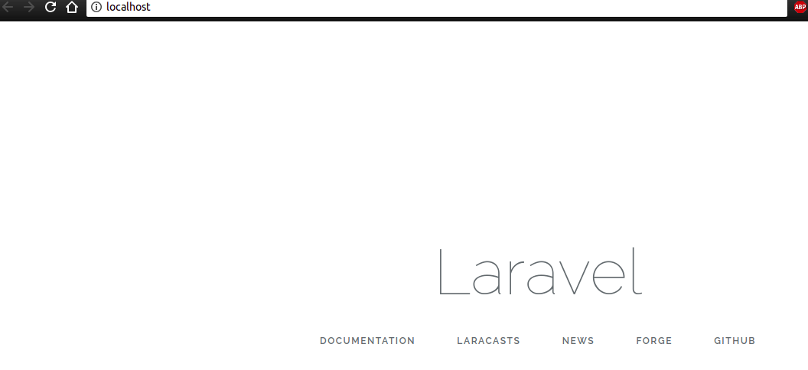

ENGINEERING
===========
This is an stack file, append here at the top.

# Sprint 1: Starting the Laravel project

```sh
git submodule add https://github.com/Laradock/laradock.git
cp laradock/env-example .env
ln -rsf .env laradock
```

Change the `.env` file:
```sh
# from
APP_CODE_PATH_HOST=../
DATA_PATH_HOST=~/.laradock/data
WORKSPACE_TIMEZONE=UTC
# to
APPLICATION=../laravel-albums/
APP_CODE_PATH_HOST=../laravel-albums/
DATA_PATH_HOST=../data
WORKSPACE_TIMEZONE=BR
```

Back to the terminal.
```sh
cd laradock
docker-compose up nginx mysql workspace
# in a new terminal, since I like to keep an eye on the output log
docker-compose exec workspace bash
# this chages context to the _worksapce_ service container
composer create-project --prefer-dist laravel/laravel laravel-albums

# back to the host
exit
# back to the root project
cd ..
# Ajust recently created laravel project (laravel-albums)
sudo chown -R puhl:puhl . && sudo chmod -R g+rw .
```



```sh
dc -f laradock/docker-compose.yml exec --user=laradock workspace php artisan make:auth
dc -f laradock/docker-compose.yml exec --user=laradock workspace php artisan  make:model --all Artist
# --all Generate a migration, factory, and resource controller for the model
```

# Sprint 0: Understanding the Problem

## 1. Extracting the text from pdf with `GostScritp`

```sh
gs -sDEVICE=txtwrite -o RunWeb-DesenvolvedorWeb.pdf.txt RunWeb-DesenvolvedorWeb.pdf
```

## 2. Tecnology Stack

> - Docker, Docker-compose
> - PHP, Laravel Framework 5.6
> - PostgreSQL or MySQL
> - Bootstrap front-end framework or Material Design
> - Ajax
> - CSS3 using Sass
> - Javascript
> - Translation keys
> - Unit tests

My experience covers it all, except by the assumed use of the blade templating engine
provided with laravel. I have never before used it and integrating CSS, SASS, Material and l10n (localization) may be hard.

As for the base, [Laradock](http://laradock.io/) seems to be the way to go.

## 3. Problem Scope

To quote directly:
> Application for managing music albums.

### Entities

The entities involved as follow.
- Artist
  - Name
  - Image
  - Genre
  - Description
- Album
  - Cover photo
  - Name
  - Year
- Song
  - Name
  - Duration
  - Composer
  - Order number
- User
  - Name
  - Email address
  - Image
  - Password
  - Admin permissions

### Operations

#### CRUD
Those entities will need CRUD operations as described:
- **C:** Create (Register)
- **R:** Read (View)
- **U:** Update (Edit)
- **D:** Delete (Remove)
- Index (List)

Other miscellaneous operations are:
#### Search
Provided an search string or search term, returns Artist, Album or Song.

#### Authentication (AuthN)
Provided an email and password returns an user and session token.

### Authorization (AuthZ)

Access to operations will be controlled by three roles, each widening the access: Public, User and Administrator.

For the [Search](#Search) and [AuthN (infered)](#authn) operations, the access will be Public.

| Entity        | Index     | Read      | Create    | Update    | Delete    |
|---------------|-----------|-----------|-----------|-----------|-----------|
| **Artist**    | Public    | Public    | User      | User      | User      |
| **Album**     | Public    | Public    | User      | User      | User      |
| **Song**      | Public    |           |           |           |           |
| **User**      | Admin<sup>[1](#n1) | User<sup>[1](#n1) | Admin | Admin | Admin |
<a name="n1">1</a>: Operation not described in the original request, but infered.
